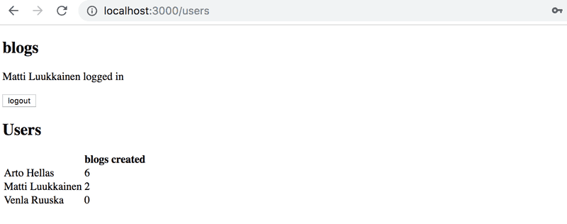
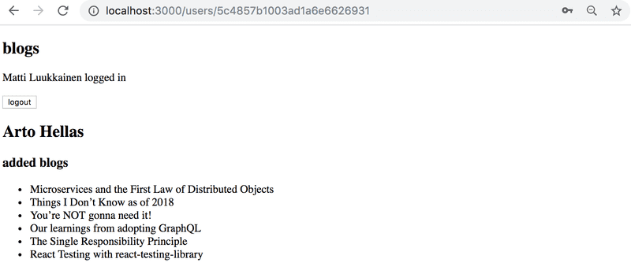
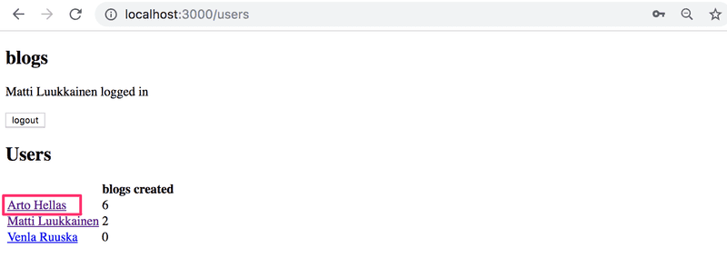
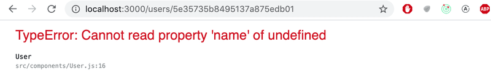
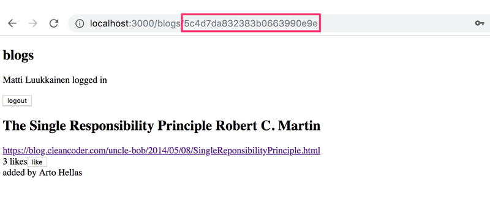
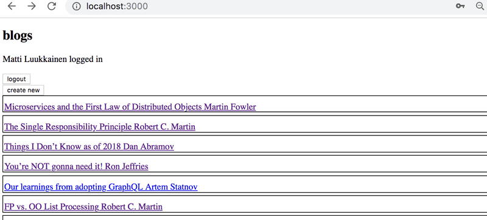
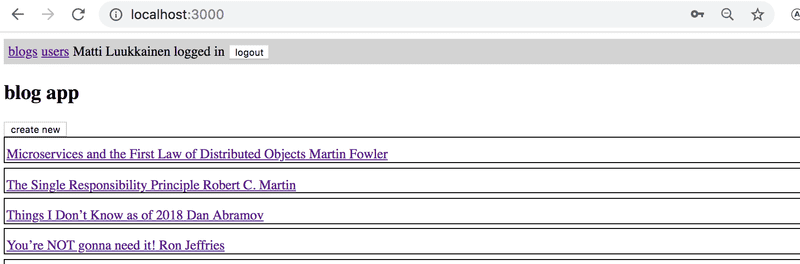

# 7.10: React Query and Context step 1

Refactor the app to use the useReducer-hook and context to manage the
notification data.

## 7.11: React Query and Context step 2

Use React Query to manage the state for blog posts. For this exercise, it is
sufficient that the application displays existing blogs and that the creation of
a new blog is successful.

You are free to manage the state for logging in and creating new blog posts by
using the internal state of React components.

## 7.12: React Query and Context step 3

Expand your solution so that it is again possible to like and delete a blog.

## 7.13: React Query and Context step 4

Use the useReducer-hook and context to manage the data for the logged in user.

## 7.14: Users view

Implement a view to the application that displays all of the basic information
related to users:



## 7.15: Individual User View

Implement a view for individual users that displays all of the blog posts added
by that user:



You can access this view by clicking the name of the user in the view that lists
all users:



**NB:** you will almost certainly stumble across the following error message
during this exercise:



The error message will occur if you refresh the individual user page.

The cause of the issue is that, when we navigate directly to the page of an
individual user, the React application has not yet received the data from the
backend. One solution for this problem is to use conditional rendering:

```jsx
const User = () => {
  const user = ...

  if (!user) {
    return null
  }

  return (
    <div>
      // ...
    </div>
  )
}
```

## 7.16: Blog View

Implement a separate view for blog posts. You can model the layout of your view
after the following example:



Users should be able to access this view by clicking the name of the blog post
in the view that lists all of the blog posts.



After you're done with this exercise, the functionality that was implemented in
exercise 5.7 is no longer necessary. Clicking a blog post no longer needs to
expand the item in the list and display the details of the blog post.

## 7.17: Navigation

Implement a navigation menu for the application:


