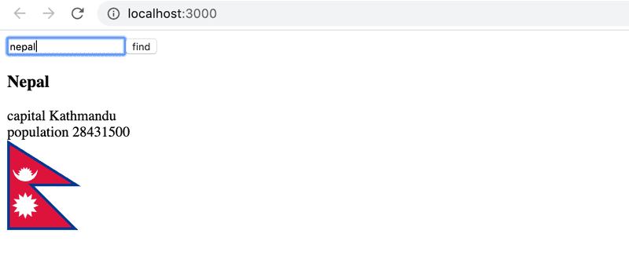
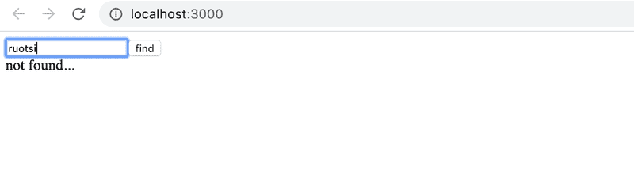

# 7.7: Country hook

Let's return to exercises [2.18-2.20](https://fullstackopen.com/en/part2/adding_styles_to_react_app#exercises-2-18-2-20).

Use the code from <https://github.com/fullstack-hy2020/country-hook> as your starting point.

The application can be used to search for a country's details from the service in <https://studies.cs.helsinki.fi/restcountries/>. If a country is found, its details are displayed:

If no country is found, a message is displayed to the user:

The application is otherwise complete, but in this exercise, you have to implement a custom hook `useCountry`, which can be used to search for the details of the country given to the hook as a parameter.

Use the API endpoint [name](https://studies.cs.helsinki.fi/restcountries/) to fetch a country's details in a `useEffect` hook within your custom hook.

Note that in this exercise it is essential to use useEffect's [second parameter](https://react.dev/reference/react/useEffect#parameters) array to control when the effect function is executed. See the course [part 2](https://fullstackopen.com/en/part2/adding_styles_to_react_app#couple-of-important-remarks) for more info how the second parameter could be used.
