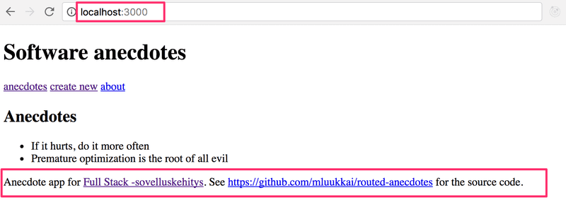
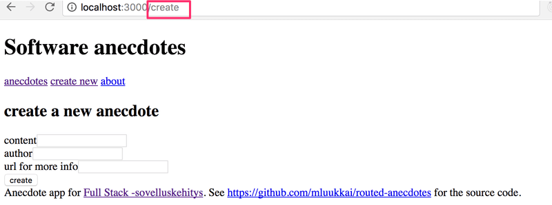
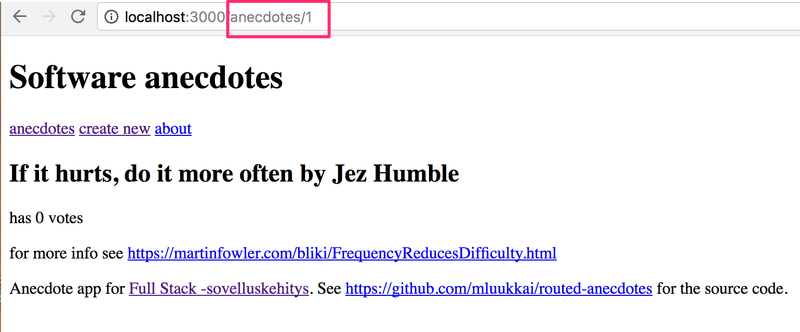
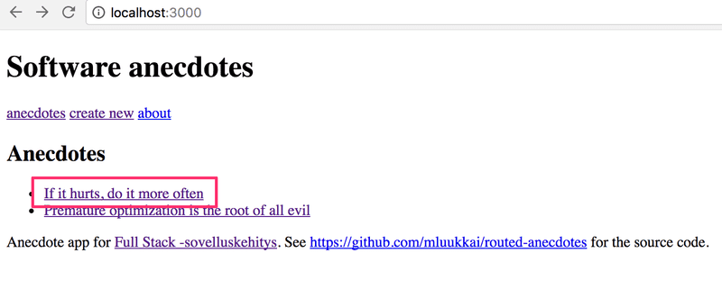
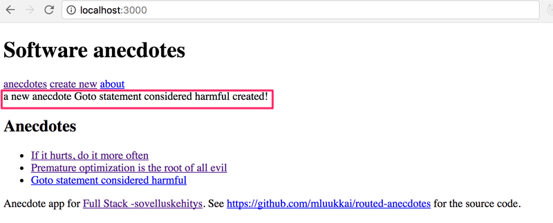

# Exercises 7.1.-7.3

Let's return to working with anecdotes. Use the redux-free anecdote app found in the repository <https://github.com/fullstack-hy2020/routed-anecdotes> as the starting point for the exercises.

If you clone the project into an existing git repository, remember to _delete the git configuration of the cloned application_:

```bash
cd routed-anecdotes   // go first to directory of the cloned repository
rm -rf .git
```

The application starts the usual way, but first, you need to install its dependencies:

```bash
npm install
npm run dev
```

## 7.1: Routed Anecdotes, step 1

Add React Router to the application so that by clicking links in the _Menu_ component the view can be changed.

At the root of the application, meaning the path /, show the list of anecdotes:



The _Footer_ component should always be visible at the bottom.

The creation of a new anecdote should happen e.g. in the path _create_:



## 7.2: Routed Anecdotes, step 2

Implement a view for showing a single anecdote:



Navigating to the page showing the single anecdote is done by clicking the name of that anecdote:



## 7.3: Routed Anecdotes, step3

The default functionality of the creation form is quite confusing because nothing seems to be happening after creating a new anecdote using the form.

Improve the functionality such that after creating a new anecdote the application transitions automatically to showing the view for all anecdotes and the user is shown a notification informing them of this successful creation for the next five seconds:



## Exercises 7.4.-7.8

We'll continue with the app from the [exercises](https://fullstackopen.com/en/part7/custom_hooks) of the [react router](https://fullstackopen.com/en/part7/react_router) chapter.

## 7.4: Anecdotes and Hooks step 1

Simplify the anecdote creation form of your application with the `useField` custom hook we defined earlier.

One natural place to save the custom hooks of your application is in the _/src/hooks/index.js_ file.

If you use the [named export](https://developer.mozilla.org/en-US/docs/Web/JavaScript/Reference/Statements/export#description) instead of the default export:

```js
import { useState } from 'react';

export const useField = type => {
  const [value, setValue] = useState('');

  const onChange = event => {
    setValue(event.target.value);
  };

  return {
    type,
    value,
    onChange,
  };
};

// modules can have several named exports

export const useAnotherHook = () => {
  // ...
};
```

Then [importing](https://developer.mozilla.org/en-US/docs/Web/JavaScript/Reference/Statements/import) happens in the following way:

```jsx
import { useField } from './hooks';

const App = () => {
  // ...
  const username = useField('text');
  // ...
};
```
